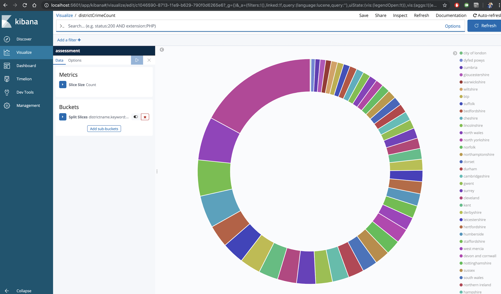

# UK reported street crimes dataset analysis
An analysis of UK crime data using Apache Spark. The data can be pulled from the [UK Street Crime Data Link](https://data.police.uk/data/).

#### Technologies Used
 - Scala
 - Spark Sql
 - ElasticSearch
 - Kibana
 
## Requirements
 - Docker
 - SBT
 
## Get docker compose files
You will need these files to deploy Eleasticsearch, Kibana, and Spark So, first clone this repo by following these commands:
  * `git version`
  * `git clone https://github.com/shnayan/assesment.git`
  * `sudo chown -R $USER:$USER assessment`
  * `cd assessment`
## TO push data to Elastic Search from Spark   
  * `./run-script.sh file to push data to elstic index`. It will run following commands:
      * `sbt assembly`
      * `docker-compose up -d` 
      * `container=`docker ps | awk ' /spark-master-1/ {print $1}'` `
      * `docker cp target/scala-2.11/*jar  $container:/home`
      * `docker cp src/main/resources/ $container:/home`
      * `docker exec spark-master-1 /spark/bin/spark-submit  --master local --deploy-mode client  home/assessment-assembly-1.0.jar --verbose --conf "spark.driver.extraJavaOptions=-Dconfig.file=/home/resources/application.conf" --conf "spark.executor.extraJavaOptions=-Dconfig.file=home/resources/application.conf`

## Now we can visulaize the data using Kibana Dashboard.
 * `we can create visulaization of our data`
 * `I have created using pie chart with disctrictName vs total Crime Count` 
 
